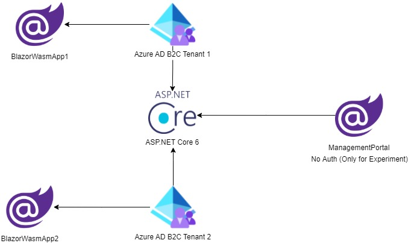

# Azure ADB2C Multiple Tenants AspNetCore6 Blazor Experiments
I have two applications and an API server. application1's user can not login using application2 and vice versa. I have some api that can access only application1 and some for application2. Some api's are shared. Management portal used for creating user in Azure AD B2C for Experiment and it does not has any auth.

## Architecture
